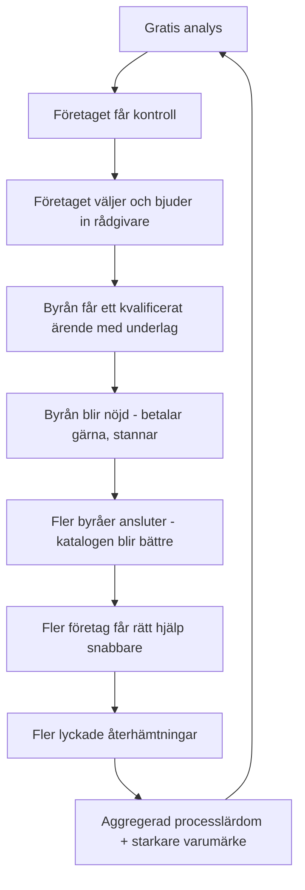

# BUSINESS OPERATING MODEL – CLEARANCE V1.0

**Hur verksamheten fungerar som system.** Det här är navet: en ny VD,
investerare eller styrelseledamot ska efter en genomläsning förstå exakt hur
verksamheten fungerar, vilka hävstänger som driver den och vilka beslut som får
störst effekt. Detaljerna bor i satellitdokumenten (§5) – här bor systemet.

---

## 1 · Executive Summary

**Vad är CLEARANCE?** En sambandscentral för företag i ekonomisk kris –
digital infrastruktur för ekonomisk återhämtning, levererad som mjukvara.
Plattformen strukturerar läget (deterministisk systemanalys, frister,
kontrollbalans), driver processen (handlingsplaner, dokument, dokumentation som
håller juridiskt) och kopplar in rätt expertis vid rätt tidpunkt (verifierad
rådgivarkatalog med samtyckesstyrd ärendedelning).

**Vilket problem löser vi?** När ett bolag hamnar i kris löper juridik, skatt,
bank, personal och myndighetskontakter parallellt – och ingen har full kontroll.
Missade frister skapar personligt ansvar; fel eller sen expert kostar bolag som
kunde ha räddats. Problemet är inte informationsbrist utan kontrollförlust.

**Varför måste vi existera?** Tiotusentals svenska bolag hamnar årligen i
obeståndsnära lägen. De möts i dag av fragmenterad information, dyra timmar och
tystnad – de mest utsatta får minst struktur. Ingen aktör äger förloppet mellan
"första krissignal" och "stabil igen". Det är det förlopp CLEARANCE äger.

**Hur tjänar vi pengar?** Fyra strömmar: låg månadsavgift från företaget
(golvet), värdehändelser från byråsidan – upplåsta, kvalificerade ärenden –
(hävstången), premiumhändelser till självkostnad + marginal, och licens för
storbyrå. Kärnanalysen har noll marginalkostnad; payback sker månad ett på
företagssidan och vid första upplåsningen på byråsidan. Styrande regel G6:
plattformen tjänar alltid mer när kunden lyckas än när kunden misslyckas.

**Hur ser ett färdigt ekosystem ut?** Företag i riskzon går in via gratis
analys, får kontroll, kopplar in verifierade experter; byråer får sitt
ärendeinflöde härifrån för att underlagen är bäst; återhämtade bolag stannar i
hälsonivån; banker och revisionskedjor ansluter sina portföljer via licens.
Måttet på framgång: **antal företag som återgår till ekonomisk stabilitet med
hjälp av CLEARANCE** (§10).

---

## 2 · Operating Principles – konstitutionen

**Intäktsgrundsatserna (G1–G6, ur Revenue Architecture):**

| # | Grundsats |
|---|---|
| G1 | Det juridiskt kritiska ligger aldrig bakom betalvägg |
| G2 | Analyser debiteras aldrig per styck |
| G3 | Desperation prissätts inte |
| G4 | Intäkten följer kalkylerbart värde – hos den som kan kalkylera det |
| G5 | Ärendedata är aldrig en intäktsström |
| G6 | Plattformen tjänar alltid mer när kunden lyckas än när den misslyckas |

**Operativa principer (ur hur plattformen faktiskt byggts – de är redan praxis):**

| # | Princip | Praxis som bevisar den |
|---|---|---|
| O1 | **Förtroende är produkten** | Ingen data lämnar servern; delning kräver uttryckligt samtycke; varje delning redovisas |
| O2 | **Juridisk korrekthet före tillväxt** | Rådgivningsgränsen står i varje dokument; sanktionerade formuleringar; borgenärsisolering i databasen |
| O3 | **Kontroll före automation** | Autoslutförande av uppgifter sker bara när stegen bevisligen genomförts; KYC är manuell med flit - den prövar företrädarrätt, vilket ingen legitimationstjänst gör åt oss |
| O4 | **Transparens före optimering** | Debiteringsöversikt före faktura; pris före klick; avböj gratis; inga tysta överhopp – allt rapporteras med skäl |
| O5 | **Determinism före generativt** | Samma indata ger samma rapport; varje mening testad; ett LLM-införande är ett styrelsebeslut, inte en feature |
| O6 | **Inget försvinner tyst** | Append-only-logg; frysning i stället för radering; misslyckade utskick syns tills de hanterats |
| O7 | **Bevisat före påstått** | Varje löfte asserteras: RLS i två miljöer, avidentifiering testad tecken för tecken, design geometriskt vaktad |

---

## 3 · Flywheel



**Loopens motor** är steget C→D: samtyckesstyrd delning som ger byrån ett
underlag den inte kan få någon annanstans. **Loopens bränsle** är H: varje
lyckad återhämtning är både varumärke (referens, recension, kunskapsartikel)
och G6-intäkt (hälsonivå).
**G5-vakt på "mer data":** lärdomen som återförs är *processlärdom*
(vilka spelböcker fungerar, var fastnar ärenden) – aldrig såld eller delad
ärendedata. Datat gör produkten bättre, inte intäkten direkt.

**Kallstartsstrategi** (flywheelens svaghet är start): förifyllda profiler +
anspråksflödet bygger utbudssidan utan att invänta ansökningar; kunskapsbanken
bygger efterfrågesidan utan annonsbudget.

---

## 4 · Operating Engines

*Ägare i dag: grundaren (Landvex). Kolumnen anger den roll som ska äga motorn
när organisationen växer.*

| Motor | Input | Output | Kärn-KPI | Framtida ägare | Största risk | Automationsgrad i dag |
|---|---|---|---|---|---|---|
| **Produkt** | Pilotdata, kundfeedback, roadmap §6 | Skeppade funktioner med tester | Leveranstakt; andel funktioner med bevisad ekonomisk effekt | CPO/teknik | Nyckelpersonberoende (en utvecklingslinje) | Hög: 20 testsviter, designvakter, två DB-miljöer i CI-form |
| **Marknad** | Kunskapsartiklar, SEO, gratisanalysen | Genomförda analyser → konton | Analyser/vecka; q (analys→konto) | Tillväxtansvarig | Fel kanalantagande; CAC okänd | Medel: innehåll manuellt, tratten mätbar i systemet |
| **Partner** | Förifyllda profiler, anspråk, ansökningar, avtal | Verifierade byråer med satta planer | Aktiva byråer; f (upplåsningsgrad); tid-till-verifiering | Partneransvarig | KYC-kön blir flaskhals; Creditsafe-avtalet drar ut | Medel: flöden byggda, granskning manuell (avsiktligt, O3) |
| **Drift** | Driftpanelens köer (ansökningar, anspråk, utkorg, kunder) | Beslut, nycklar, fakturor, återöppningar | KYC-kö < 48 h; 0 ohanterade driftlarm | Operations | Tyst kö-tillväxt | Hög: jobb, påminnelser, stängning, omskick automatiserade; besluten mänskliga |
| **Ekonomi** | `usage_charges`, fakturaserien, kostnadsavtal | Samlingsfakturor, styrpaneler, EM/UE-uppdateringar | Fakturerat/mån; bruttomarginal/ström; DSO | CFO (deltid först) | Fakturering blockerad (bankgiro/momsreg); kreditförluster byrå | Hög: hela kedjan händelse→faktura är kod |
| **Juridik** | Insolvensprövning, avtal, namnfråga, GDPR | Godkända avgiftsmodeller, partneravtal, varumärke | 0 öppna blockerande juridikpunkter | Extern jurist → bolagsjurist | Success-fee/avgifter mot obestånd klandras; namnkollision | Låg (och ska så vara) |

---

## 5 · Economic System – hur dokumenten hänger ihop

```
CONTROL PLAN ──────── vad plattformen är (funktioner, integrationer, kostnads-/värdedrivare)
      │
REVENUE ARCHITECTURE ─ vem som betalar, för vad, när, varför rättvist (G1–G6, RLV, 4 strömmar)
      │
ECONOMIC MODEL ─────── ramarna på makronivå (cost-to-serve, marginaler, break-even ~tiotals ärenden)
      │
UNIT ECONOMICS ─────── samma ekonomi per resa (payback månad 1 resp. första upplåsningen; G6 = 7,5×)
      │
      └──► PILOT byter [ANTAGANDE] mot [FAKTA] ──► PRISSÄTTNING V1.0 (kort dokument, sist)
```

Ingen dubblering: ändras en parameter, ändras den i Economic Model och ärvs
nedåt. Detta dokument äger *besluten*; satelliterna äger *beräkningarna*.

---

## 6 · Product Roadmap – affärsstyrd

Prioritet = ekonomisk effekt ÷ byggkostnad, med G6-kolumnen som veto-fråga.

| Funktion | Ekonomisk effekt (källa) | G6? | Beroende | Prioritet |
|---|---|---|---|---|
| **Exitorsak registreras** | Gör G6 och bra churn mätbara – låser upp hela styrningen (UE §7) | Mäter den | Liten migration | **P0** |
| **Hälsonivån** (efterlevnads-/bevakningsläge) | Största obelånade RLV-termen: 38 % av vinnarresans värde (UE §3) | Bärare av G6 | Produktdesign | **P1** |
| Gratisanalysens rapportkvalitet (iterativt) | Driver q – enda hävstången mot anskaffningsförlusten (UE §1) | Neutral | – | P1 (löpande) |
| Förhandsvisningens kvalitet (iterativt) | Driver f – störst hävstång i hela modellen (EM §7) | Ja | Pilotdata | P1 (löpande) |
| ~~BankID~~ | **Bortvalt.** Signering byggd i egen regi utan avtal och utan avgift per gång (docs/signering.md); KYC förblir manuell för att den prövar företrädarrätt | – | – | – |
| Fortnox/Visma direktimport | Sänker tröskeln in (q) och höjer underlagskvaliteten (f) | Ja | Avtal | P2 |
| Kontorsstruktur (flera handläggare/byrå) | Öppnar ström D (enterprise) | Ja | Design | P3 |
| Flerspråk (en → ar/uk) | Marknadsbreddning; störst social effekt | Ja | Översättningsprocess | P3 |
| Öppna banken-saldon, OCR m.m. | Ej validerad efterfrågan | – | – | Backlog |

**Vad som INTE byggs** (lika viktigt): borgenärsvy (beslutat nej),
per-analys-mätare (G2), riskprissättning (G3), datamonetisering (G5).

---

## 7 · Operating Dashboard – VD:ns morgonvy

| # | KPI | Källa | Status |
|---|---|---|---|
| 1 | Aktiva bolag (ärenden i krisfas) | `cases` | ✅ mätbar i dag |
| 2 | Gratisanalyser senaste 7 d | wizard-händelser | ✅ |
| 3 | q: analys → konto | tratten | ✅ |
| 4 | Aktiva verifierade byråer | `professionals` | ✅ |
| 5 | Förfrågningar senaste 7 d | `contact_requests` | ✅ |
| 6 | f: upplåsningsgrad | `contact_requests.status` | ✅ |
| 7 | Intäkt fakturerad denna månad (per ström) | fakturaserien + `usage_charges` | ✅ |
| 8 | Ofakturerat underlag (kommande samlingsfakturor) | debiteringsöversikten | ✅ |
| 9 | RLV, rullande snitt per avslutad resa | härledd | ⬜ kräver exitorsak (P0) |
| 10 | Bra churn (stabiliserad/rekonstruerad) vs dålig churn | exitorsak | ⬜ P0 |
| 11 | Genomsnittlig krislängd L_kris | skapad→exit | ✅ (rå), ⬜ (orsak) |
| 12 | k: hälsokonvertering | hälsonivån | ⬜ P1 |
| 13 | KYC-kö (väntande anspråk + ansökningar, äldsta i timmar) | driftpanelen | ✅ |
| 14 | Creditsafe-kostnad MTD vs budget | slagningslogg × avtalspris | ⬜ avtal |
| 15 | Kundsignal: NPS/CSAT efter exit + supportärenden öppna | enkät + inkorg | ⬜ enkät saknas; inkorg ✅ |

**Regel:** varje ⬜ är en byggpunkt med namn i roadmapen – ingen KPI får stanna
som önskemål.

---

## 8 · Risk Register – prioriterat, med ägare

| # | Risk | Kategori | Sannolikhet | Effekt | Ägare | Mitigering |
|---|---|---|---|---|---|---|
| 1 | Fakturering förblir blockerad (bankgiro/momsreg/F-skatt) | Finans | Hög tills åtgärdad | Ingen intäkt alls | Grundaren | Administrativ punkt – görs före allt annat i Q1 |
| 2 | Avgifter mot obeståndsnära bolag klandras (återvinning/skälighet) | Juridik | Medel | Modell + rykte | Extern jurist | Insolvensprövning före pilot; låg platt A-avgift; A1-frågan |
| 3 | Hönan-ägget: tunn katalog → låg f | Marknad/Partner | Medel | Hävstången uteblir | Partneransvarig | Förifyllda profiler + anspråk (byggt); handplockad pilotkohort |
| 4 | Nyckelpersonberoende i utveckling | Teknik/Org | Hög | Leveransstopp | Styrelse | Testsviterna + dokumentationen är avlastningen; rekrytering vid pilotbevis |
| 5 | KYC-kön växer tyst | Drift | Medel | Byråtillväxt stannar | Operations | KPI 13 med larmgräns; fler granskare vid behov |
| 6 | "AI"-förväntan urholkar determinism-löftet (O5) | Produkt/AI | Medel | Förtroende + kostnadsbas | CPO | LLM-införande = styrelsebeslut med egen riskanalys |
| 7 | Namnkollision (Clearance/Clarence) | Juridik | Medel | Omprofilering | Grundaren | Varumärkessökning före publik lansering |
| 8 | Creditsafe-beroende (pris/villkor ändras) | Partner | Låg–medel | A-marginalen | Partneransvarig | Pluggbar källa i arkitekturen (byggt); UC som alternativ |
| 9 | GDPR-incident i ärendedata | Regelefterlevnad | Låg | Existentiell | Operations | RLS i två miljöer (testat), append-only, inga tredjelandsflöden |
| 10 | Rådgivningsgränsen överträds i copy | Juridik/Produkt | Låg | Ansvar | CPO | Gränstext i varje dokument (byggt) + juridisk copygranskning |

---

## 9 · 12-månaders Execution Plan

| Kvartal | Mål | Leveranser | KPI-mål | Beslutspunkter |
|---|---|---|---|---|
| **Q1 – Grund** | Pilotbar plattform + juridisk grund | Bankgiro/momsreg klart; insolvensprövning; exitorsak (P0); hälsonivå MVP (P1); intervjuguider + 10+10 intervjuer | Dashboard-KPI 1–8, 13 live | A1 (avgift vid konkurs); pilotparametrar; namnfrågan |
| **Q2 – Pilot** | Verklig användning, verkliga fakturor | 15–25 företagsärenden, 5–10 byråer med satta planer; första samlingsfakturorna; tidsloggning KYC | q, f, L_kris mätta på riktigt; 0 ohanterade driftlarm | Creditsafe-avtalet tecknas eller omplaneras |
| **Q3 – Validering** | Antaganden → fakta; pris sätts | EM/UE uppdaterade med pilotdata; **Prissättning v1.0** (kort); hälsonivå v1 med första konverteringarna; NPS-enkät | Payback ≤ 1 mån bekräftad; f ≥ basantagande; k första mätning | Go/no-go skala; rekrytering utveckling |
| **Q4 – Skala** | Flywheelen snurrar av egen kraft | Marknadsmotor på (innehållskalender); Fortnox/Visma-import; kontorsstruktur → enterprise-pilot 1–2 kedjor | Analyser/vecka ×3; byråretention > 90 %; North Star-mätningen börjar | Ström D-prislogik; organisationens första anställningar |

---

## 10 · North Star

> ## Antal företag som återgår till ekonomisk stabilitet med hjälp av CLEARANCE.

Inte omsättning. Omsättning är, per G6 och hela den ekonomiska arkitekturen, en
*följd* av det här talet – varje stabiliserat bolag bär abonnemang,
värdehändelser, hälsonivå och varumärke, medan varje misslyckande kapar
kedjan.

**Mätning:** exitorsak (P0) gör talet exakt: exits märkta *stabiliserad* eller
*rekonstruktion genomförd*. Redovisas ackumulerat och per kvartal, överst på
dashboarden.

**Vaktmått** (så att North Star inte spelas): andel av alla exits som är
lyckade (kvalitet, inte bara volym) · tid till stabilitet · NPS vid exit.

**Beslutsregeln:** när två vägval står mot varandra vinner det som flyttar
North Star – prissättning, roadmap, partnerval, allt. Det är så intäkterna
förblir en följd av uppdraget i stället för ett mål i sig.

---

*Satellitdokument: `kontrollplan-prissattning.md` · `revenue-architecture.md` ·
`economic-model.md` · `unit-economics.md`. Plattformsstatus per commit
`63b4726`. Detta dokument revideras vid varje kvartalsbeslut i §9.*
