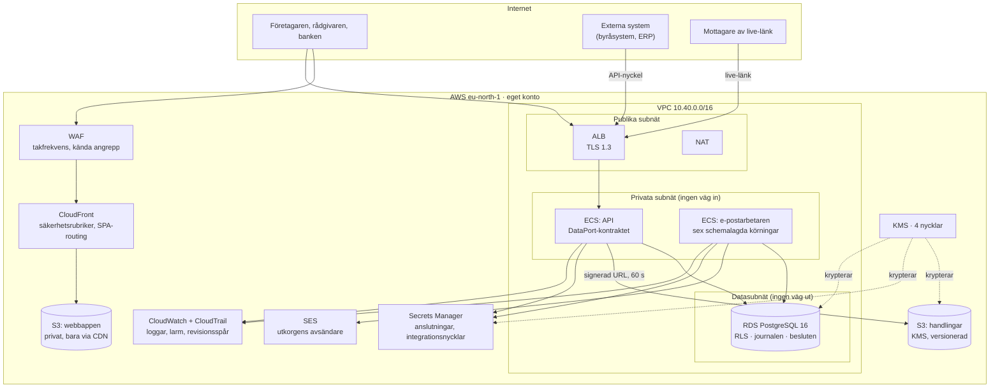

# Infrastrukturkarta

**Version 1.0 · Koden finns i `infra/` (Terraform). Besluten bakom finns
i `db/README.md`. Det här dokumentet är kartan: vad som körs, vad det gör
för produkten, och vad som ännu inte finns.**

## Kartan i en bild

## Varje del, och vad den bär i produkten

| Del | AWS | Vilket produktflöde faller utan den |
|---|---|---|
| **Databasen** | RDS PostgreSQL 16, multi-AZ, PITR 14 dagar | Allt. Ärenden, samtalsjournalen, besluten med premiss, uppgifterna, fakturorna, API-nycklarnas hashar. **Radskyddet (RLS) bor här** — det är produktens säkerhetsmodell, inte ett lager ovanpå |
| **Webbappen** | S3 + CloudFront + WAF | Hela gränssnittet. Privat hink, OAC — det finns ingen hink-URL som går runt WAF:en |
| **API:et** | ECS Fargate bakom ALB | Samtalet, ärendedatan, det öppna API:t, live-länkarna. Uppfyller `DataPort` |
| **E-postarbetaren** | ECS Fargate på EventBridge-schema | Utkorgen, betalningspåminnelser, kontostängning **med besked**, kreditbevakning, de två månadsfaktureringarna |
| **Handlingarna** | S3, SSE-KMS, versionerad | Dokumentarkivet, aktexporten, PDF:erna. Nås bara via signerad URL på 60 sekunder, **alltid efter** `app.may_read_document()` |
| **E-post ut** | SES + DKIM/SPF/DMARC | Fakturor och inbjudningar till borgenärer. Studsar och klagomål larmar |
| **Hemligheterna** | Secrets Manager + KMS | Anslutningssträngarna. Integrationsnycklarnas **plats** — värdet sätts i driftpanelen, aldrig i kod |
| **Spåren** | CloudWatch, CloudTrail, S3-åtkomstloggar | Vem gjorde vad, i appen (journalen) och i driften (CloudTrail) |

## De sex körningarna

Arbetaren (`db/worker/email-worker.ts`) körs som schemalagda
Fargate-uppgifter. Tiderna står i `infra/main.tf` som data, inte utspridda
i resurser:

| Körning | När | Varför just då |
|---|---|---|
| `(ingen flagga)` | var 5:e minut | Utkorgen ska kännas omedelbar |
| `--remind` | varje timme | Dubblettskyddet bor i databasen, så den kan gå ofta |
| `--close` | 03:15 | Stänger förfallna konton **och köar beskedet i samma körning** |
| `--credit` | 05:30 | Högst en kreditslagning per bolag och dygn — varje kostar |
| `--invoice-referrals` | 1:a kl. 06 | Föregående månads förmedlingsfakturor |
| `--invoice-usage` | 1:a kl. 07 | En samlingsfaktura per byrå |

## Fyra regler infrastrukturen inte får bryta

1. **Databasen är aldrig publik.** Radskydd hjälper inte mot någon som
   kan ansluta som ägaren. `publicly_accessible = false`, egna datasubnät
   utan default-route.
2. **API:et ansluter som `app_user`** — som varken äger en tabell eller
   har `BYPASSRLS`. Båda stänger av radscopingen *tyst*, och tyst är det
   farliga: frågorna fortsätter fungera och börjar returnera andra bolags
   insolvensdata.
3. **`set_config('app.user_id', ..., true)`** — transaktionslokalt, i
   samma transaktion som frågorna. Sessionslokalt på en poolad anslutning
   läcker föregående requests identitet till nästa.
4. **Aldrig en signerad URL utan `app.may_read_document()` först.** En
   signerad URL kringgår all databasbehörighet — det är hela poängen med
   den.

## Vad som är byggt, och vad som saknas

| Del | Status |
|---|---|
| Migrationerna och radskyddet | **Byggt.** 240 kontroller, gröna i *båda* miljöerna |
| Självhostad Postgres utan Supabase | **Bevisat.** `npm run test:selfhosted` reser ren Postgres och kör hela sviten |
| E-postarbetaren | **Byggd.** TypeScript, bundlas med `npm run build:worker` |
| Webbappen | **Byggd.** Noll externa anrop, verifierat (`test:external`, 9/9 sidor) |
| Terraform för nät, databas, lagring, CDN, e-post, hemligheter, larm | **Skrivet** i `infra/` — `terraform fmt` går igenom |
| **API:et (`awsAdapter` mot DataPort)** | **Saknas.** Klienten pratar idag PostgREST via Supabase-klienten. `DataPort` är hela kontraktet — en adapter plus en rad i `src/data/index.ts` |
| **Egen autentisering** | **Schema klart** (`auth.sessions`, token som SHA-256), API saknas. Argon2id i API:et |
| **S3-signering** | `app.may_read_document()` klar, signeringskoden saknas |
| **`lookup-company`** | Finns som Supabase edge function, ska bli endpoint i eget API |
| **Applicerad infrastruktur** | **Nej.** Inget AWS-konto är kopplat. `infra/` är kartan och beställningen, inte ett kvitto |
| **`terraform validate`** | **Inte kört.** Utvecklingsmiljön når inte `registry.terraform.io`; kör det i en miljö med nätåtkomst innan första `apply` |

## Öppna beslut

* **Gallringsreglerna.** Hur länge revisionsspåret ska bevaras efter
  avslutat ärende, och hur det förhåller sig till en begäran om radering.
  Tills det är avgjort raderar livscykelreglerna i S3 **ingenting** —
  gamla versioner flyttas bara till billigare lagring.
* **En eller två NAT.** `single_nat_gateway = true` halverar den fasta
  kostnaden men gör en zon till en gemensam felpunkt. Ska bli `false`
  inför skarp drift med betalande kunder.
* **Avancerad signatur.** Signeringen är byggd i egen regi som en enkel
  elektronisk signatur (docs/signering.md). Om en kund kräver en
  avancerad eller kvalificerad signatur blir det ett eget beslut med
  egen kostnad - inte något plattformen väntar på idag.

---

*Infrastrukturen är beställd av produkten, inte tvärtom: varje resurs i
`infra/` går att peka på ett flöde som faller utan den. Det som inte gör
det ska inte resas.*
