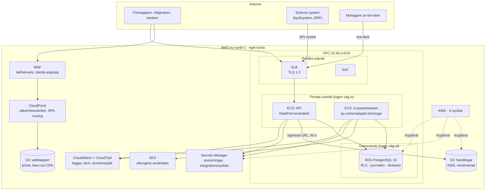

# Infrastrukturkarta

**Version 1.0 · Koden finns i `infra/` (Terraform). Besluten bakom finns
i `db/README.md`. Det här dokumentet är kartan: vad som körs, vad det gör
för produkten, och vad som ännu inte finns.**

## Kartan i en bild

## Varje del, och vad den bär i produkten

| Del | AWS | Vilket produktflöde faller utan den |
|---|---|---|
| **Databasen** | RDS PostgreSQL 16, multi-AZ, PITR 14 dagar | Allt. Ärenden, samtalsjournalen, besluten med premiss, uppgifterna, fakturorna, API-nycklarnas hashar. **Radskyddet (RLS) bor här** — det är produktens säkerhetsmodell, inte ett lager ovanpå |
| **Webbappen** | S3 + CloudFront + WAF | Hela gränssnittet. Privat hink, OAC — det finns ingen hink-URL som går runt WAF:en |
| **API:et** | ECS Fargate bakom ALB | Samtalet, ärendedatan, det öppna API:t, live-länkarna. Uppfyller `DataPort` |
| **E-postarbetaren** | ECS Fargate på EventBridge-schema | Utkorgen, betalningspåminnelser, kontostängning **med besked**, kreditbevakning, de två månadsfaktureringarna |
| **Handlingarna** | S3, SSE-KMS, versionerad | Dokumentarkivet, aktexporten, PDF:erna. Nås bara via signerad URL på 60 sekunder, **alltid efter** `app.may_read_document()` |
| **E-post ut** | SES + DKIM/SPF/DMARC | Fakturor och inbjudningar till borgenärer. Studsar och klagomål larmar |
| **Hemligheterna** | Secrets Manager + KMS | Anslutningssträngarna. Integrationsnycklarnas **plats** — värdet sätts i driftpanelen, aldrig i kod |
| **Spåren** | CloudWatch, CloudTrail, S3-åtkomstloggar | Vem gjorde vad, i appen (journalen) och i driften (CloudTrail) |

## De sju körningarna

Arbetarna (`db/worker/email-worker.ts` och
`db/worker/notification-worker.ts`) körs som schemalagda
Fargate-uppgifter. Tiderna står i `infra/main.tf` som data, inte utspridda
i resurser:

| Körning | När | Varför just då |
|---|---|---|
| `(ingen flagga)` | var 5:e minut | Utkorgen ska kännas omedelbar |
| `--remind` | varje timme | Dubblettskyddet bor i databasen, så den kan gå ofta |
| `--close` | 03:15 | Stänger förfallna konton **och köar beskedet i samma körning** |
| `--credit` | 05:30 | Högst en kreditslagning per bolag och dygn — varje kostar |
| `--gallra` | 04:00 | Gallring (GDPR art. 5.1 e) i skuggläge tills en kategori aktiveras |
| `--invoice-referrals` | 1:a kl. 06 | Föregående månads förmedlingsfakturor |
| `--invoice-usage` | 1:a kl. 07 | En samlingsfaktura per byrå |
| `simulation-worker` | varje minut | Monte Carlo-körningar över 50 000 iterationer. API:t är enprocessigt; en miljon iterationer tar dryga två sekunder och hör inte hemma i en handler |
| `notification-worker` | var 5:e minut | Aviseringskön. Beslut per rad, uppskjutning vid tyst tid — se `docs/aviseringar.md` |

Aviseringsarbetaren behöver utöver `DATABASE_URL`, `SES_REGION` och
`MAIL_FROM` en SMS-nyckel i `integration_secrets` under `46elks`. Saknas
den skickas inga SMS, och varje rad får skälet utskrivet i driftpanelen —
den låtsas aldrig ha skickat.

## Fyra regler infrastrukturen inte får bryta

1. **Databasen är aldrig publik.** Radskydd hjälper inte mot någon som
   kan ansluta som ägaren. `publicly_accessible = false`, egna datasubnät
   utan default-route.
2. **API:et ansluter som `clearance_api` och kör som `authenticated`.**
   Två roller, två uppgifter, och skillnaden är inte kosmetisk:
   `withUser()` växlar till `authenticated` för användarens frågor, medan
   `withAnon()` ALDRIG byter roll - den kör som anslutningens egen, och den
   vägen bär inloggningen, sessionsuppslaget och utloggningen.
   `auth.users`/`auth.sessions` är med flit revoke:ade från klientrollerna,
   så anslutningsrollen måste vara medlem i `app_api` som bär exakt de
   rättigheterna. Utan det svarar API:t 403 på varje inloggningsförsök
   medan `/v1/health` är grönt. Se `db/roles-selfhosted.sql`.

   Om rollen ändå kör som `authenticated` — en roll som varken äger en tabell
   eller har `BYPASSRLS`. Båda stänger av radscopingen *tyst*, och tyst är
   det farliga: frågorna fortsätter fungera och börjar returnera andra
   bolags insolvensdata. Rollen sätts med `set local role` i varje
   transaktion (`api/server/db.ts`).

   Varför `authenticated` och inte `app_user`, som den här raden sa förut:
   tabellrättigheterna är skrivna till `authenticated`, som är **medlem** i
   `app_user` och därmed ärver nedåt, inte uppåt. `app_user` ensamt saknar
   select och faller på 42501. `app_user` är kvar som den roll som
   definierar begränsningen.
3. **`set_config('app.user_id', ..., true)`** — transaktionslokalt, i
   samma transaktion som frågorna. Sessionslokalt på en poolad anslutning
   läcker föregående requests identitet till nästa.
4. **Aldrig en signerad URL utan `app.may_read_document()` först.** En
   signerad URL kringgår all databasbehörighet — det är hela poängen med
   den.

## Vad som är byggt, och vad som saknas

| Del | Status |
|---|---|
| Migrationerna och radskyddet | **Byggt.** 253 kontroller, gröna i *båda* miljöerna |
| Självhostad Postgres utan Supabase | **Bevisat.** `npm run test:selfhosted` reser ren Postgres och kör hela sviten. Rättat: tabellrättigheterna kom tidigare från RLS-svitens egen blanka grant, aldrig från `db/bootstrap.sql` - självhostat hade första frågan fallit på 42501. Nu delas de ut i bootstrap, och `npm run test:api` bevisar det utan att någon testfil städar först |
| E-postarbetaren | **Byggd.** TypeScript, bundlas med `npm run build:worker` |
| Webbappen | **Byggd.** Noll externa anrop, verifierat (`test:external`, 9/9 sidor) |
| Terraform för nät, databas, lagring, CDN, e-post, hemligheter, larm | **Skrivet** i `infra/` — `terraform fmt` går igenom |
| **API:et: identitet, sessioner, översiktens data och dess skrivvägar** | **Byggt.** `api/server/`, node:http med **ett** beroende (`pg`). Läsning och skrivning för ärenden, journal, beslut, uppgifter, betalningar, dokumentmetadata (inkl. signerad nedladdning), meddelanden, KBR, kontaktinkorgen, ärendets deltagare/inbjudningar och rådgivarens anteckningar/tidsposter. `npm run test:api` kör 185 kontroller mot riktig Postgres — identiteten läcker inte mellan samtidiga requests, en utomstående får TOMT på varje resurs, avbockningens tidpunkt sätts av servern, företagaren kan inte godkänna sitt eget underlag, en icke-administratör ser en tom kontaktinkorg, en inbjudan kan bara accepteras av rätt adress, och en intern anteckning är författarens ensak även för en annan deltagare |
| **API:et: resten av `DataPort`** | **Delvis.** Katalog, marknadsplats, fakturans utställande — 48 metoder kvar. Samma mönster igen; siffran mäts av `test:awsadapter` och ska falla |
| **`awsAdapter` i klienten** | **Halvfärdig, och säger det själv.** `src/data/aws/`, vald med `VITE_DATA_ADAPTER=aws`. **101 av 149 portmetoder** går mot eget API; resten delegeras öppet till supabase-adaptern (strangler). `MIGRATED_PORTS` är listan och `npm run test:awsadapter` läser den — den som flyttar en port men glömmer listan får rött, och den som listar något oflyttat likaså. Delegeringen tas bort när listan täcker hela `DataPort` |
| **Egen autentisering** | **Byggt.** Inloggning, sessioner och utloggning i `api/server/auth.ts`. KDF är `scrypt` ur Node själv, inte Argon2id: en nativ modul hade gett API:t en byggkedja att sitta fast i, och hashformatet bär sina parametrar så ett byte blir ett nytt prefix, inte en migrering |
| **S3-signering** | **Byggd.** `api/server/storage.ts` + `GET /v1/documents/{id}/url`: `app.may_read_document()` → presignerad GET-URL som går ut på 60 s. `storage_path` lämnar aldrig servern. `test:storage` (11 kontroller) vaktar ordningen och att svaret bär url, inte sökväg. Tom endpoint = AWS S3; satt = MinIO (forcePathStyle) |
| **Bokföringen som lägesbild** | **Byggd och körd.** SIE-filen är bokföringsadaptern som inte kräver ett leverantörsavtal: `POST /v1/cases/{id}/financial/sie` tolkar filen **på servern** (`src/lib/financial/sie.ts` + `fromSie.ts`), sparar en `financial_snapshots`-rad bakom radskyddet och matar analysmotorn på översikten. `financial.getLatestSnapshot()` returnerade förut `null` rakt av, så insiktslistan var permanent tom i skarp drift. Prövad mot riktig Postgres och över riktig HTTP mot det byggda API:t |
| **Monte Carlo-motorn** | **Byggd och körd.** `src/lib/montecarlo/` - elva fördelningar, egen seedad PRNG (PCG32), eget uttrycksspråk utan `eval`, statistik, känslighet och konvergens. Persistens i `simulations`/`simulation_runs` (aggregat, aldrig rådata). Åtta API-rutter. Tunga körningar köas till `simulation-worker`. 289 egna kontroller + 60 i API-sviten; 1M iterationer på 2,6 s (391k it/s) |
| **`lookup-company`** | Finns som Supabase edge function, ska bli endpoint i eget API |
| **Applicerad infrastruktur** | **Nej.** Inget AWS-konto är kopplat. `infra/` är kartan och beställningen, inte ett kvitto. Följdriktigt svarar ingen av adresserna i API-kontraktet — det står numera överst på `/api`, inte i en fotnot |
| **`terraform validate`** | **Inte kört.** Utvecklingsmiljön når inte `registry.terraform.io`; kör det i en miljö med nätåtkomst innan första `apply` |

## Öppna beslut

* **Gallringsreglerna.** Hur länge revisionsspåret ska bevaras efter
  avslutat ärende, och hur det förhåller sig till en begäran om radering.
  Tills det är avgjort raderar livscykelreglerna i S3 **ingenting** —
  gamla versioner flyttas bara till billigare lagring.
* **En eller två NAT.** `single_nat_gateway = true` halverar den fasta
  kostnaden men gör en zon till en gemensam felpunkt. Ska bli `false`
  inför skarp drift med betalande kunder.
* **Avancerad signatur.** Signeringen är byggd i egen regi som en enkel
  elektronisk signatur (docs/signering.md). Om en kund kräver en
  avancerad eller kvalificerad signatur blir det ett eget beslut med
  egen kostnad - inte något plattformen väntar på idag.

---

*Infrastrukturen är beställd av produkten, inte tvärtom: varje resurs i
`infra/` går att peka på ett flöde som faller utan den. Det som inte gör
det ska inte resas.*
