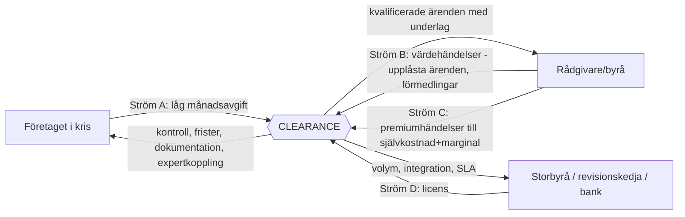

# REVENUE ARCHITECTURE – CLEARANCE V1.0

**Affärsmodellen först. Priserna allra sist.**

Det här dokumentet beskriver *vem som betalar, för vad, när, varför det upplevs
som rättvist och vad betalaren får tillbaka* – för varje intäktsström. Det sätter
inga belopp. Varje ström är märkt med sin status i den byggda plattformen, sin
mätpunkt och sina risker. Underlaget är CONTROL PLAN V1.0
(`docs/kontrollplan-prissattning.md`) och den körande produkten.

---

## 0 · Arkitekturens grundsatser

Fem regler som all intäkt måste klara. De är härledda ur produktens löfte
("Vi säljer inte rädsla. Vi säljer kontroll."), ur kostnadskartan och ur
insolvensrättens realiteter – inte ur tycke.

| # | Grundsats | Konsekvens |
|---|---|---|
| G1 | **Det juridiskt kritiska ligger aldrig bakom betalvägg.** Frister, KBR-varningar, ärendets läge och notiserna om dem ingår alltid. | En missad frist för att kortet inte gick igenom är ett förstört varumärke och en möjlig skada. Grundavgiften är tillgång till *plattformen*, inte till *varningarna*. |
| G2 | **Analyser debiteras aldrig per styck.** Marginalkostnaden är noll (deterministiska motorer) och varje analys ökar kundens kontroll. | Obegränsade analyser är ett säljargument, inte en kostnad. |
| G3 | **Desperation prissätts inte.** Ingen avgift får växa med hur illa bolaget ligger till, och inga stora avgifter tas av bolag i obeståndsnära läge. | Risk-/kreditbaserade modeller uteslutna. Företagssidans avgift är låg och platt per segment. |
| G4 | **Intäkten följer levererat, kalkylerbart värde – hos den som kan kalkylera det.** | Värdehändelserna faktureras byråsidan, där nyttan är rationell (intagskostnad ↓, debiterbar tid ↑). |
| G5 | **Ärendedata är aldrig en intäktsström.** Ingen försäljning av data, inga annonsintäkter, ingen "anonymiserad statistik till banker". | Förtroendet ÄR produkten. Detta står här för att det ska vara ett beslut, inte en glidning. |
| G6 | **Plattformen ska alltid tjäna mer när kunden lyckas än när kunden misslyckas.** | Ryggraden. En lyckad rekonstruktion ska vara mer lönsam för CLEARANCE än en konkurs (längre ärende, fler värdehändelser, efterföljande hälsofas). Ett återhämtat bolag ska kunna stanna som betalande kund i en enklare hälso-/efterlevnadsnivå. Byråer med många lyckade uppdrag ska vilja stanna och investera mer. Varje framtida intäktsidé prövas mot frågan: *tjänar vi mer på att det går bra?* Om inte, byggs den om eller förkastas. |

---

## 1 · Översikt: fyra strömmar, två sidor



**Strukturell nyckelinsikt:** företagssidan är *transient* – ett lyckat ärende
lämnar krisläget. Det är **bra churn ur krisen** och ska firas. Byråsidan är den
*återkommande* relationen: samma byrå möter nya ärenden år efter år. Arkitekturen
lägger därför tyngdpunkten av den långsiktiga intäkten på sidan med långsiktig
närvaro – **och ger det återhämtade bolaget en väg att stanna** (hälsonivån
nedan), så att G6 håller även på företagssidan.

### Recovery Lifetime Value (RLV)

Måttet arkitekturen optimerar för. **RLV = det totala värdet av ett företag från
första krissignal tills det är ekonomiskt stabilt – och tiden därefter.**

```
RLV = (A × L_kris)            grundabonnemang under krisfasen
    + (V × f × u)             värdehändelser: förfrågningar × andel upplåsta × byråavgift*
    + (P)                     premiumhändelser (signering, bevakning, integrationer)
    + (H × L_hälsa × k)       hälsonivån efter krisen × konverteringsgrad
    + (T)                     framtida tilläggstjänster
```
*Byråavgiften bokförs på byråsidan men uppstår ur företagets ärende – RLV räknar
värdet per *ärende över båda sidor*, för det är så G6 mäts: en lyckad resa
maximerar varje term; en konkurs kapar de tre sista.

**Produktimplikation (medveten bygglucka):** hälsonivån – ett enklare
efterlevnads-/bevakningsläge för det återhämtade bolaget (frister, KBR-vakt,
kreditbevakning, årshjul) – är **inte byggd**. Den är arkitekturens nästa
produktyta och G6:s bärare på företagssidan.

---

## 2 · Ström A: Företaget – låg månadsavgift

| Fråga | Svar |
|---|---|
| **Vem betalar?** | Aktiebolaget (inte ägaren privat). Fakturamottagare: bolaget. |
| **För vad?** | Tillgång till sambandscentralen: obegränsade analyser, fristbevakning, KBR-modul, handlingsplaner, dokumentmallar, akt, deltagare, meddelanden, notiser. Allt kärnvärde – se G1/G2. |
| **När?** | Gratis nulägesanalys utan konto → konto med **gratisvecka** → månadsfaktura i efterskott, 10 dagars villkor. Vid utebliven betalning: påminnelse → frysning (läsläge) → stängning. **Ingenting raderas** – akten består. |
| **Varför rättvist?** | Låg, platt, förutsägbar. Bolaget betalar aldrig mer för att läget är värre (G3). Inträdet är gratis – värdet bevisas *innan* första fakturan. En löpande låg kostnad som synligt minskar risk accepteras av pressade bolag; en hög inträdesavgift gör det inte. |
| **Vad får de tillbaka?** | Kontroll: "jag vet exakt var vi står och vad som är nästa steg." Skydd mot personligt ansvar genom bevakade frister och dokumenterade beslut. Rätt expert i tid. |
| **Status i plattformen** | **Byggd end-to-end:** gratisvecka, fakturamotor (obruten nummerserie, öre-exakt moms), påminnelse-/stängningsjobb, återöppning vid betalning, frysningslöftet. |
| **Mätpunkt** | Aktiva konton × månader; segmentband (mikro/små/medel) som enda differentiering. |
| **Risker** | Betalningsförmåga i målgruppen → hanteras av låg nivå + frysning i stället för radering. Blockeras i dag av lucka 1 (bankgiro/momsreg). |

**Öppen designfråga A1:** ska månadsavgiften vara 0 kr under pågående *konkurs*
(förvaltaren har tagit över)? Talar för: G3 och relationen till förvaltarbyrån
(ström B). Beslutas efter juridisk prövning (lucka 7).

---

## 3 · Ström B: Byrån – betalning per värdehändelse

| Fråga | Svar |
|---|---|
| **Vem betalar?** | Rådgivarbyrån (rekonstruktör, förvaltare, revisor, affärsjurist) – den verifierade katalogaktören. |
| **För vad?** | **Upplåst ärende:** företaget har valt byrån, byrån har sett en avidentifierad förhandsvisning och väljer själv att låsa upp – först då uppstår avgiften. **Förmedlad förfrågan:** accepterad kontakt via katalogen. Att avböja kostar ingenting; priset visas *före* beslutet. |
| **När?** | Vid händelsen registreras avgiften; **en samlingsfaktura per månad** med klickbar specifikation (datum, ärendetyp, bolag, orgnr, tjänst, belopp) + löpande debiteringsöversikt innan fakturan skickas. |
| **Varför rättvist?** | Byrån betalar för ett kvalificerat, underbyggt ärende – en rationell kalkyl (intagstimmar sparade, hög konverteringssannolikhet eftersom *företaget valde byrån*). Ingen avgift utan avtalad nivå; utan avtal är upplåsningen kostnadsfri och driften ser det. Inga överraskningar: översikten visar nästa faktura i förväg. |
| **Vad får de tillbaka?** | Flöde av ärenden med komplett beslutsunderlag (situation, nyckeltal, systemanalys, dokumentlista, skäl till kontakten), portföljvy, praktikerrapporter, massexport, fakturacentral. |
| **Status i plattformen** | **Byggd end-to-end:** kontaktförfrågan med samtycke → förhandsvisning → upplåsning mot villkor → `usage_charges` → månadsjobb → samlingsfaktura. Prisplaner per byrå (per ärende/abonnemang/användning/licens) som driftparametrar. Kreditspärr byggd men avstängd (förtroende först). |
| **Mätpunkt** | Upplåsta ärenden, accepterade förmedlingar, abonnemangsmånader – alla mäts redan per rad. |
| **Risker** | Hönan-och-ägget: tunn katalog → få förfrågningar → svag betalningsvilja. Mitigering: förifyllda profiler + anspråksflödet bygger utbudssidan billigt; nollavgift tills avtal finns sänker byråns tröskel. |

---

## 4 · Ström C: Premiumhändelser – självkostnad + marginal

| Fråga | Svar |
|---|---|
| **Vem betalar?** | Primärt byrån; i utvalda fall företaget (t.ex. signering) – aldrig så att G1 bryts. |
| **För vad?** | Händelser med **verklig rörlig kostnad** hos tredje part: daglig kreditbevakning (Creditsafe), framtida direktintegrationer (Fortnox/Visma-koppling, byråsystems-API). Signering hör INTE hit - den är byggd i egen regi och kostar oss ingenting per gång (docs/signering.md). |
| **När?** | Per händelse eller som tillval per månad – på samma samlingsfaktura (raderna finns redan som `usage_charges`-typer att utöka). |
| **Varför rättvist?** | Avgiften speglar en kostnad som faktiskt uppstår hos leverantören + skälig marginal. Transparent: raden visar vad som utlöste den. |
| **Vad får de tillbaka?** | Juridiskt starkare signaturer, tidig varning vid kreditförsämring, noll dubbelinmatning. |
| **Status i plattformen** | Kreditbevakningen byggd (väntar avtal/nyckel). Signeringen byggd, utan leverantör. Integrationsramen ("Inom kort") byggd. Debiteringsraden och samlingsfakturan byggda. |
| **Mätpunkt** | Signeringar, bevakade bolag × dagar, aktiva integrationer. |
| **Risker** | **Nickel-and-diming** – tio små avgifter känns värre än en stor. Mitigering: baka in upp till tak i grund-/byråavgiften, visa premiumhändelser som ingår innan de debiteras separat. Blockeras av luckorna 2–4 (avtalspriser). |

---

## 5 · Ström D: Enterprise/licens

| Fråga | Svar |
|---|---|
| **Vem betalar?** | Större byråer, revisionskedjor, ev. banker/långivare som vill erbjuda plattformen till kunder i riskzon. |
| **För vad?** | Volym (många samtidiga ärenden), integration mot egna system (aktexport i dag, API i morgon), samlad fakturering, förtur i verifiering, SLA/support. På sikt: egen miljö. |
| **När?** | Årslicens eller månadslicens med volymband; värdehändelser antingen inkluderade upp till tak eller rabatterade. |
| **Varför rättvist?** | Förutsägbar kostnad för en organisation som inte kan hantera styckdebitering; priset motiveras av volym och integration, inte av kundernas nöd (G3 gäller även här: bankens slutkund får inte bli debiteringsobjekt). |
| **Vad får de tillbaka?** | Standardiserat intag, portföljöverblick över alla handläggare, dokumentationsspår som håller i tillsyn. |
| **Status i plattformen** | `plan_kind='enterprise'` finns som parameter (inga automatiska styckavgifter). Portfölj, massexport och samlingsfaktura byggda. Fleranvändar-/kontorsstruktur (flera handläggare under en byrå) är **inte** byggd – största kända byggluckan för denna ström. |
| **Mätpunkt** | Licenser × band; aktiva handläggare; integrationsanvändning. |
| **Risker** | Säljs för tidigt utan volymbevis; kräver referenskunder ur ström B först. |

---

## 6 · Prisbärarna finns redan – parametrar, inte kod

| Parameter | Var den bor | Sätts av |
|---|---|---|
| Månadsavgift företag (per segmentband) | Fakturamotorn (`customer_invoices`) | Drift |
| Gratisveckans längd | `billing`-logiken | Drift |
| Avgift per upplåst ärende | `billing_plans.unlock_fee_sek` per byrå | Drift |
| Avgift per förmedling | `professionals.referral_fee` per byrå | Drift |
| Byråabonnemang/månad | `billing_plans.monthly_fee_sek` | Drift |
| Plantyp (per ärende/abonnemang/användning/licens) | `billing_plans.plan_kind` | Drift |
| Kreditspärr (av som standard) | `professionals.billing_hold` | Drift |
| Premiumhändelser | `usage_charges.service_code` (utökningsbar CHECK-lista) | Migration + drift |

Att gå från "ingen prissättning" till "pilotprissättning" är alltså **datainmatning
i driftpanelen**, inte utveckling – med undantag för enterprise-strömmens
kontorsstruktur.

---

## 7 · Psykologin, uttryckt som designregler

1. **Låg tröskel slår hög övertygelse.** Bolaget i kris jämför inte offerter – det
   tvekar. Gratis analys → gratisvecka → låg månadsavgift möter tvekan i rätt ordning.
2. **Löpande kostnad accepteras när den synligt minskar risk.** Därför visar
   produkten ständigt vad som bevakas (frister, läge, "Detta saknas") – fakturan
   ska kännas som en vaktpost, inte en prenumeration.
3. **Byrån betalar gärna för säkerhet i beslutet.** Förhandsvisning före
   upplåsning, pris före klick, avböj gratis – varje friktionssänkning på
   byråsidan höjer betalningsviljan mer än någon rabatt.
4. **Ingen ska upptäcka en avgift i efterhand.** Debiteringsöversikten före
   fakturan och den klickbara specifikationen är intäktsarkitekturens
   viktigaste förtroendefunktioner – och de är redan byggda.

---

## 8 · Validerings-KPI:er (före kronor)

| KPI | Frågan den besvarar | Källa (finns) |
|---|---|---|
| Gratisanalys → konto-konvertering | Bär värdelöftet i steg 3→4? | Konton/ärenden |
| Konto → aktiv vecka 2 | Överlever engagemanget gratisveckan? | Händelseloggen |
| Förfrågningar per aktivt ärende | Uppstår värdehändelser organiskt? | `contact_requests` |
| Upplåsningsgrad (upplåsta/förfrågningar) | Är förhandsvisningen tillräcklig för byråns ja? | `contact_requests.status` |
| Tid förfrågan → upplåsning | Är flödet snabbt nog för en kris? | Tidsstämplar |
| "Bra churn": andel avslut som är stabilisering/rekonstruktion | Lämnar kunder för att det gick bra? | Exitorsak (bör börja registreras – **liten bygglucka**) |
| Byråretention månad 6 | Är byråsidan den återkommande relationen? | Fakturaserien |

---

## 9 · Beslutsordning härifrån

| Ordning | Beslut/aktivitet | Beroende |
|---|---|---|
| 1 | **Economic Model v1.0** (`docs/economic-model.md`): cost-to-serve, marginaler, break-even som parametriserad modell | Detta dokument |
| 2 | Insolvensrättslig prövning av företagssidans avgifter (inkl. designfråga A1) | Jurist |
| 3 | Bankgiro + momsreg/F-skatt bekräftas | Landvex admin |
| 4 | Avtalspriser: Creditsafe, Fortnox/Visma | Partnerförhandling |
| 5 | Betalningsviljeintervjuer, 10–15 per sida, guider ur värdedrivarna | Marknad |
| 6 | Pilot med verkliga kunder (parametrar i driftpanelen; ett segmentband, en byråkohort) | 1–5 |
| 7 | Exitorsak börjar registreras (bra churn- och G6-mätningen) | Liten migration |
| 8 | Först här: dokumentet **Prissättning v1.0** med kronor | 1–7 |

---

*Underlag: CONTROL PLAN V1.0 samt plattformen per commit `ca6a22d`. Dokumentet
sätter ramverket; alla belopp hör hemma i Prissättning v1.0, efter besluten ovan.*
