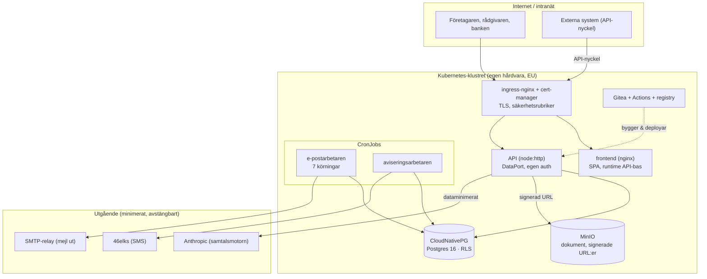

# Egenhostad drift på Kubernetes

**Version 0.1 · Koden bor i `deploy/` (Helm) och `.gitea/` (CI). Det här är kartan och besluten bakom en HELT egenhostad Clearance — ingen molnleverantörs hanterade tjänster, ingen tredjepart som håller våra data.**

> **Varför självhostat.** Clearance behandlar de känsligaste uppgifter ett bolag har — insolvensläget, borgenärerna, styrelsens ansvar — för en utsatt målgrupp. Ju färre parter som rör datan, desto mindre kan läcka och desto färre avtal (DPA) måste tecknas. Målet här är att *hela* driften ska gå att köra på egen järnhårdvara (eller en enskild VPS-leverantör i EU) utan AWS, Supabase eller någon annan hanterad backend. Den befintliga AWS-Terraformen i `infra/` blir ett **alternativ**, inte kravet.

## Principerna (ärvda, gäller oförändrat)

De fyra reglerna från `docs/infrastructure.md` gäller lika hårt här — plattformen byter, inte säkerhetsmodellen:

1. **Databasen är aldrig publik.** Postgres når bara appen inifrån klustret (ClusterIP, NetworkPolicy), aldrig ett publikt värdnamn.
2. **API:et kör som `authenticated`** — en roll utan tabellägande och utan `BYPASSRLS`. Rollen sätts transaktionslokalt (`set local role`), radskyddet (RLS) bor i databasen.
3. **`set_config('app.user_id', …, true)`** — transaktionslokalt, aldrig sessionslokalt på en poolad anslutning.
4. **Aldrig en signerad URL utan `app.may_read_document()` först.**

Och till dem, för det egenhostade:

5. **Ingen data lämnar klustret utan skäl.** Modellsamtalet (Anthropic) och ev. bolagsuppslag (Google) är de enda utgående dataflödena, och de är dataminimerade och avstängbara (se `docs/subprocessors-dpa.md`). Allt annat — databas, dokument, mejlkö, git, CI, container-register — bor i klustret.

## Stacken (beslut och skäl)

| Lager | Val | Varför just detta |
|---|---|---|
| **Orkestrering** | Kubernetes (valfri distро: k3s för en nod, kubeadm/RKE2 för fler) | Standarden. k3s gör en enda kraftig server till ett komplett kluster; samma manifest skalar till flera noder. |
| **Paketering** | Helm-chart (`deploy/helm/clearance`) | Ett värde-styrt chart per miljö (prod/stage). Inga handredigerade manifest som glider isär. |
| **Databas** | **CloudNativePG**-operatorn (Postgres 16) | Bästa egenhostade Postgres på k8s: HA/failover, PITR-backup till S3/MinIO, roller och `initdb` deklarativt. Inte en naken StatefulSet man själv måste baksätta. |
| **Objektlagring** | **MinIO** (S3-kompatibel) | Dokumenten nås via *signerade S3-URL:er* (`app.may_read_document()` → presignerad URL). MinIO ger exakt det S3-kontraktet, egenhostat. API:ets S3-klient pekas mot MinIO via `endpoint`. |
| **Ingång/TLS** | ingress-nginx + cert-manager | En publik ingress, TLS automatiskt (Let's Encrypt, eller intern CA i ett slutet nät). Säkerhetsrubrikerna sätts här, som CloudFront gjorde. |
| **Git + CI** | **Gitea** + Gitea Actions, med Giteas inbyggda container-register | Egen git och egen CI, inget GitHub. Actions-syntaxen är GitHub-kompatibel; registret ligger i samma tjänst. |
| **Container-register** | Giteas inbyggda registry (eller Harbor om fler team) | Images stannar på egen infrastruktur. |
| **Mejl ut** | **SMTP** (egen relay eller EU-SMTP), inte SES | Egenhostat kan inte luta sig mot AWS SES. E-postarbetaren får en SMTP-transport vid sidan av SES-vägen, vald med `MAIL_TRANSPORT`. |
| **SMS** | 46elks (redan byggt, `db/worker/sms/`) | Svensk leverantör, ren HTTP-API. Nyckeln i `integration_secrets`, inget AWS. |
| **Hemligheter** | Kubernetes Secrets (rekommendation: SOPS/age eller Sealed Secrets för GitOps) | Anslutningssträngar och nycklar injiceras som env/filer. Aldrig i image, aldrig i git i klartext. |
| **Auth** | **Appens egen** (`api/server/auth.ts`) | Ingen extern IdP. Sessioner och API-nycklar hanteras av API:et mot Postgres — det var redan byggt och är hela poängen med "egen auth". |
| **Observability** | Loggar till stdout (samlas av klustret); rekommendation: Loki + Grafana, Prometheus på `/v1/health` | Egenhostat spår, ingen CloudWatch. |

## Komponentkarta

## Dataflödet in i klustret (deploy)

1. Push till Gitea → **Gitea Actions** kör `lint`, `typecheck`, hela testsviten (inkl. `test:selfhosted` och `test:api` mot en Postgres-tjänstcontainer).
2. Bygger tre images (API, worker, frontend) och pushar till Giteas registry.
3. `helm upgrade` rullar ut mot klustret; en **migrations-Job** kör före API:t startar (samma migrationsordning som `db/tests/run.sh` bevisar).

## Vad som redan finns (bygger vi på)

- `api/Dockerfile`, `db/Dockerfile` — tvåstegsbyggen, kör som `node`, aldrig root. API på **8080**, healthcheck `/v1/health`.
- `db/bootstrap.sql` + `db/tests/run.sh` — självhostad Postgres med roller och grants, **bevisad** via `npm run test:selfhosted` och `npm run test:api`.
- 46elks-SMS i `db/worker/sms/` — redan icke-AWS.

## Vad det här arbetet lägger till

- `deploy/helm/clearance/` — hela stacken som chart (fylls i grundat på de faktiska env-varen; se avsnittet Env nedan).
- Frontend-image som servar SPA:n med **runtime**-injicerad API-bas-URL (samma image i alla miljöer).
- MinIO + presignerade dokument-URL:er i API:et (`api/server/storage.ts`,
  `GET /v1/documents/{id}/url`): `app.may_read_document()` → 60 s GET-URL,
  `storage_path` lämnar aldrig servern. Vaktat i `npm run test:storage`.
- SMTP-transport i e-postarbetaren (`MAIL_TRANSPORT=smtp`).
- Gitea-deploy + `.gitea/workflows/ci.yml`.
- Migrations-Job.

## Env-kontraktet (load-bearing — exakt som koden läser det)

| Variabel | Komponent | Obl.? | Källa | Notis |
|---|---|---|---|---|
| `PORT` | API | nej | ConfigMap/inline | default 8080 |
| `DATABASE_URL` | API | **ja** | Secret `database-url` | rollen **clearance_api** (LOGIN, medlem i authenticated), aldrig BYPASSRLS |
| `PGPOOL_MAX` | API | nej | ConfigMap | default 10 |
| `SESSION_TTL_HOURS` | API | nej | ConfigMap | default 12 |
| `ANTHROPIC_API_KEY` | API | nej | Secret | tom = samtalet ej anslutet (kraschar inte) |
| `ANTHROPIC_MODEL` | API | nej | ConfigMap | default `claude-sonnet-5` |
| `GOOGLE_MAPS_API_KEY` | API | nej | Secret | tom = källan ej ansluten |
| `DOCUMENTS_BUCKET` | API | nej | ConfigMap (via `documents.*`) | tom = lagringen ej ansluten (`/health` `storage:false`, `/url` → 404) |
| `S3_ENDPOINT` | API | nej | Deployment-env | tom = AWS S3; satt (t.ex. intern MinIO) = egen/extern lagring |
| `S3_REGION` | API | nej | Deployment-env | default `eu-north-1` |
| `S3_FORCE_PATH_STYLE` | API | nej | Deployment-env | `true` när endpoint satt (MinIO), annars `false` |
| `S3_ACCESS_KEY_ID` / `S3_SECRET_ACCESS_KEY` | API | nej | Secret (ärver MinIO:s rot) | S3-nycklarna; utan dem används instansprofil (AWS) |
| `DATABASE_URL` | arbetare | **ja** | Secret `worker-database-url` | rollen **app_worker** (LOGIN) |
| `MAIL_FROM` | arbetare | **ja** | ConfigMap | avsändaradress |
| `APP_BASE_URL` | arbetare | nej | ConfigMap | länkbas i mejl |
| `MAIL_TRANSPORT` | arbetare | nej | ConfigMap | `smtp` (egenhostat, byggt) eller `ses`. SMTP_HOST/PORT/SECURE/USER + SMTP_PASS (Secret) |
| `SES_REGION` | arbetare | nej | ConfigMap | endast om `MAIL_TRANSPORT=ses` |
| `DATABASE_URL` | migrate | **ja** | Secret `migrate-database-url` | **superanvändare** (skapar roller/extensions) |
| `API_UPSTREAM` | frontend | nej | Deployment-env | default API-tjänsten; nginx proxar hit |
| `API_BASE_URL` | frontend | nej | Deployment-env | tom = samma origin |

**Ingen** signeringsnyckel finns (sessioner är slumpbytes, lagras som SHA-256), och API:t har **ingen CORS** — därför den samma-origin-proxande frontenden. SMS-nyckeln (46elks) bor i `public.integration_secrets` (`elks46` = `user:password`), **inte** i en k8s-Secret.

## Rollerna — byggt och prövat mot riktig Postgres

`db/bootstrap.sql` skapar `app_user`/`authenticated` som NOLOGIN, och migration `20260819100000` revoke:ar arbetarfunktionerna "för att app_worker äger dem" — men `app_worker` skapades aldrig, så en arbetare hade fallit på 42501 vid första anropet. **`db/roles-selfhosted.sql`** (kör av `migrera.sh` efter migrationerna, idempotent) tätar det:

- **`app_worker`** — betrodd batch-roll med **BYPASSRLS**. Den arbetar per sin natur över alla tenants (skickar allas post, kontrollerar allas krediter); BYPASSRLS är rätt här och **bara** här. Verifierat: den kan röra utkorgen och köra arbetarfunktionerna.
- **`clearance_api`** — API:ets roll: LOGIN, medlem i `authenticated`, **aldrig** BYPASSRLS. Verifierat: den kan `set role authenticated`, och radskyddet scopar (0 rader för en främmande identitet, inte ett fel).

`migrera.sh` sätter rollernas lösenord ur `SELFHOST_API_PASSWORD` / `SELFHOST_WORKER_PASSWORD` (chartets migrations-Job ur `selfhost-*-password`). Modellen är vaktad i **`db/tests/roles.sql`**, som körs i `test:selfhosted` och CI-jobbet `databas`: `app_worker` får skriva i utkorgen, `authenticated` nekas samma insert av radskyddet. Ingen del av det här gissas — allt är prövat mot en riktig Postgres 16.

## Öppna beslut för driftägaren

- **En nod eller flera?** k3s på en kraftig server räcker för pilot; CloudNativePG + MinIO vill ha mer disk/IO för HA.
- **TLS-utfärdare:** publik (Let's Encrypt) eller intern CA i ett slutet nät.
- **Backup-mål:** MinIO-bucket i samma kluster räcker inte som enda backup — CloudNativePG bör peka PITR mot en *separat* lagringsplats.
- **Hemlighetshantering i GitOps:** SOPS/age eller Sealed Secrets innan chartet läggs i git med riktiga värden.
